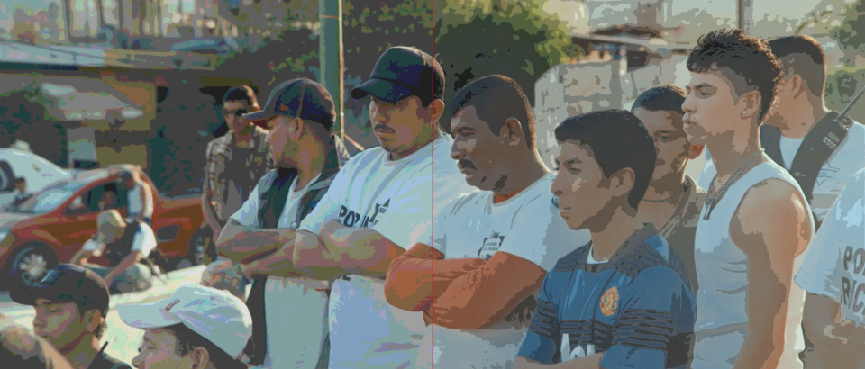

# bShaders
Effects/Filters for video playback 
This project aims at providing shaders (DirectX .hlsl or mpv .hook glsl files), tools and comparison screenshots for realtime video Effects. The focus is on best implementation (and tuned parameter settings) of lightweight gpu shaders.

Shaders tested on MPC-HC video player (EVR-CP Dx9) on integrated graphics. https://www.videohelp.com/software/Media-Player-Classic-Home-Cinema
MPC-HC enables hardware-accelerated playback of local and internet videos without requiring the installation of additional codecs.

Mpv is an open-source cross-platform video player: https://mpv.io/installation/
how to use shaders in mpv: https://forum.doom9.org/showthread.php?p=1926639#post1926639 

Effects:
- Pixelate (Mosaic)
- Edge detection (in Luma): Sobel, Prewitt, Frei-Chen
- FilmGrain/Noise (bNoise.hlsl lightweight additive noise pixel shader and others)  

Blur:
- Single-pass gSmooth (Gaussian Blur 3x3, hw.3)
- Multi-pass (Gaussian 7-tap, hw.5, hw.9, quarter-frame hw.9, Kawase, Dual-Kawase, BoxBlur(3x) with adjustable size)
- Blurred pillarbox borders (fill_bb.avs avisynth script)

Art/Style Effect for Video content (vs Film):
- Dots
- CrossHatch
- bStipple comic book style
- bSobel_Edge: grayscale Sobel Edge detection + saturated color to achieve a cartoon effect 

Tools:
- barMask (Custom Border Masks + frame shift)
...Quadri-Frame 2x2 visualization, ex: ROGB or separate grayscale RYGB components 
- bStrobe (Time-based Effect)
- test_linearSampling (test whether Hardware Linear Sampling (hw) is working in player/gpu-driver): 
...it works in mpv but not in mpc-hc/be !
- test_LimitedRange (limited range tools using Avisynth and ffmpeg)
...bHighL.hlsl (out-of-range pixel highlighting)

Mpv:
- NoChroma.hook (Grayscale source shader)
- simple examples for embedded textures and compute shaders

See also my shader gists: https://gist.github.com/butterw

---
basic intro about hlsl/glsl pixel shaders here:
https://forum.videohelp.com/threads/397797-Pixel-shaders-for-video-playback-%28-hlsl%29

Unofficial video player shaders guide: https://forum.doom9.org/showthread.php?t=181584

